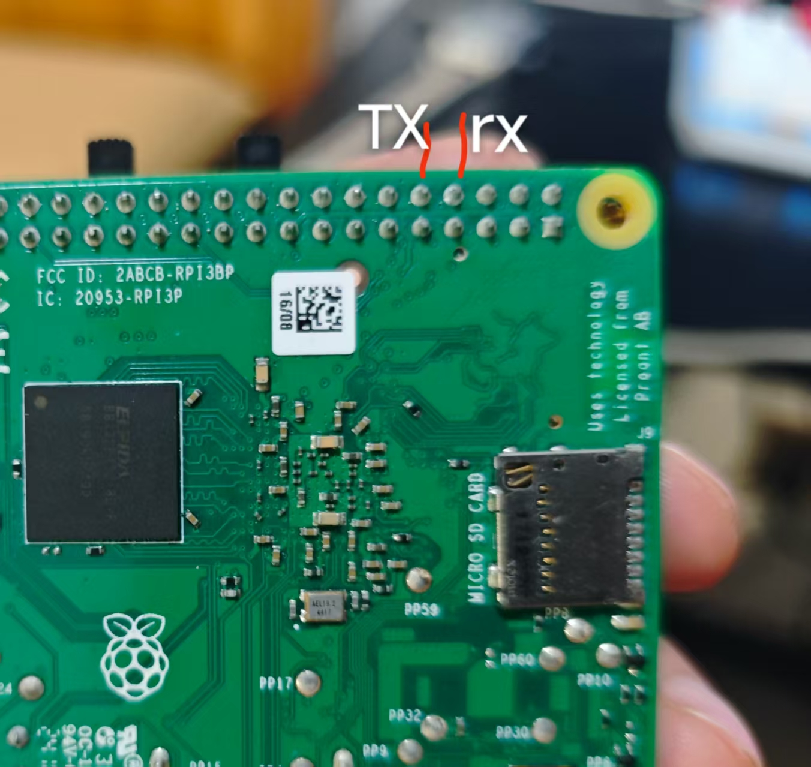

# 接线表（CH32V307V-EVT 履带小车）

依据：官方原理图 `PUB\CH32V30xSCH.pdf` 第 11 页（对应丝印 `CH32F&V30xV-R1-1v1`）。

```
          手机 Blinker 摇杆
                │ WiFi / 云
          ESP8266-01S                    电池(2S/3S)
           │   │                             │
           │   └── USART3  PB10/PB11 ──┐     │
           └── 独立 3.3V ──┐            │     │
                          │            ▼     ▼
                       [CH32V307VCT6]  ┌──────────┐  ┌──────────┐
                          │            │ 左电调   │  │ 右电调   │
                          ├─ TIM3_CH1 PA6 ─信号→┤          │  │          │
                          ├─ TIM3_CH2 PA7 ─信号→└────┬─────┘  └────┬─────┘
                          ├─ GND ────────────────┴─────────────┘
                          └─ USART1 PA9/PA10 → WCH-Link → PC(COM4)
```

---

## 1. 板子 ↔ ESP8266-01S

| ESP-01S（按丝印） | 板子 | 说明 |
|---|---|---|
| **TX** | **PB10 = J4 第 1 脚**（网络名 D15） | ESP 发 → CH32 收（**交叉接**） |
| **RX** | **PB11 = J4 第 3 脚**（网络名 D14） | CH32 发 → ESP 收 |
| **GND** | **J4 第 7 脚**（J4 上第一个 GND） | 必须共地 |
| **3V3** | 独立 3.3V（≥500mA） | **不要接 5V**；模块内没有稳压器 |
| **EN (CH_PD)** | **必须接 3V3** | ⚠️ **实测：悬空不启动**（蓝灯不亮、串口无输出）。官方 ESP-01S 原理图上 EN 有 10K 上拉，但我们这块模块不可靠 → **直接接 3.3V** |
| RST | 悬空 | 模块内部已有 10K 上拉 |
| IO0 / IO2 | 悬空 | 运行模式；只有下载固件时才动 IO0 |

**怎么找 J4 的 1 脚**：J4 是那排 2×25 双排针（Arduino 数字口那一排）。
用万用表蜂鸣档找跟板子 GND 导通的脚 = 第 7 脚，**往上数两行是第 3 脚（PB11），再上一行是第 1 脚（PB10）**。
**不要**拿 J4 第 5 脚（VDDA）或第 4 脚（VBAT）当电源。

## 2. 板子 ↔ 电调（两个有刷电调）

| 板子 | 电调 | 说明 |
|---|---|---|
| **PA6 = J4 第 29 脚**（丝印 D4） | 左电调 信号线（白/橙） | TIM3_CH1，50Hz / 1000–2000µs |
| **PA7 = J4 第 31 脚**（丝印 D3） | 右电调 信号线（白/橙） | TIM3_CH2 |
| **GND = J4 第 7 脚** | 两个电调的 黑线 | 必须共地，信号才有参考电平 |
| — | **红线（BEC 5V/6V）悬空包好** | 接进板子会把 5V 顶起来，可能烧板 |
| — | 电调电池线 → 电池；输出线 → 电机 | 动力电走电池，不要从板子取 |

脉宽约定：`1500µs = 停`、`2000µs = 满前进`、`1000µs = 满倒车`。

**万用表自检**（不接电调也能测）：直流电压档，黑笔 GND、红笔点 PA6/PA7
→ 不动 ≈0.25V、满前进 ≈0.33V、满倒车 ≈0.17V。

## 3. 烧 ESP8266 时的临时接线（USB-TTL）

| USB-TTL | ESP-01S | 说明 |
|---|---|---|
| TX | RX | 交叉 |
| RX | TX | |
| GND | GND | |
| 3.3V | **不接** | USB-TTL 的 3.3V 只有几十 mA，带不动 ESP |

烧写流程：`IO0` 短到 GND → 上电/复位 → 上传 → **拔掉 IO0** → 再复位。
ESP 的 3V3/GND 接**独立 3.3V（≥500mA）**，最好在模块脚上并 470µF + 100nF。

## 4. 板上已被占用 / 别乱用的引脚

| 引脚 | 用途 | 备注 |
|---|---|---|
| PA9 / PA10 | USART1 → 板载 WCH-Link → COM4 | 调试串口，别占用 |
| PA13 / PA14 | SWD 调试 | |
| PA11 / PA12 | USB 高速口 | |
| PB6 / PB7 | USB 全速口 + 用户 OLED(I2C1) | |
| **PC6 / PC7 / PC8 / PC9** | **内置 10M 以太网 PHY 差分线** → HR911105A 网口 | 接别的会把网口电路拉歪 |
| PE9 / PE7 | 用户 LED1/LED2（J3 跳线引出） | 低电平点亮 |
| PD0 / PD1 | 8MHz 晶振 | |
| PC14 / PC15 | 32.768kHz 晶振 | |
| PB2 | BOOT1 | |
| PA0~PA3、PA4~PA7、PB0/PB1/PB3/PB4/PB5/PB8/PB9/PB12~PB15、PC0~PC5、PC10~PC13、PD2~PD7、PE0~PE15 | 空闲（J3/J4 排针上大部分都有） | 接新模块前用万用表确认一下 |

## 5. 电源拓扑与上电顺序

```
PC USB ──板载 WCH-Link──► 板子 5V 入口(F2 500mA 保险丝) ──► U1(1117-3.3) ──► 板子 3.3V
电池   ──► 左/右电调（动力）──► 电机
独立 3.3V(5V+AMS1117-3.3) ──► ESP8266（必须与板子共地）
```

* 板子 5V 入口只有 **500mA 保险丝**，MCU+WCH-Link 已占掉一部分 → **不要拿板子的 3.3V 给 ESP 供电**
* **上电顺序**：先给板子上电（程序跑起来、输出 1500µs 中位）→ 再给电调上电池（电调读中位自检）
* 三层地必须连通：板子 GND、ESP GND、电调 GND

## 6. 一页速查

```
ESP TX  → J4-1  (PB10)
ESP RX  → J4-3  (PB11)
ESP GND → J4-7  (GND)       ESP 3V3 → 独立 3.3V
ESP EN  → 3.3V  ← 必须接！悬空不启动
左电调信号 → J4-29 (PA6)     右电调信号 → J4-31 (PA7)
两个电调 GND → J4-7          电调红线(BEC) 悬空
OLED VCC → 3.3V  GND → J4-7  SCL → J4-22 (PB6)  SDA → J4-20 (PB7)
边刷1 EN → J3-43 (PE8)       边刷2 EN → J3-45 (PE10)
吸尘电调信号 → J4-17 (PB0)    共地：板子 GND ↔ 12V 电池负极
雷达 Tx → J3-34 (PA3)         雷达 VCC → 独立 5V
雷达 M_CTR → 3.3V（不是 RXD） 雷达 GND → 板子 GND
PC 调试：雷达 Tx → WCH-LinkE RX，WCH-LinkE → COM6 @115200
```

## 7. 扫地执行机构（边刷 + 涡轮风机）

| 板子 | 模块 | 说明 |
|---|---|---|
| **PE8 = J3 第 43 脚** | 边刷1 降压模块 **EN** | 高电平 = 模块输出 5V（车动时通电） |
| **PE10 = J3 第 45 脚** | 边刷2 降压模块 **EN** | 同上 |
| **PB8 = J4 第 25 脚** | 涡轮风机 **PWM** 调速线 | TIM4_CH3，**18kHz 占空比**：0% = 停、100% = 最高速 |
| 12V 电池正极 | 风机 **VCC**（电源正极） | 额定 12V（实测支持 10~15V）⚠️ **正负极绝不能接反** |
| 12V 电池负极 + 板子 GND | 风机 **GND**（电源负极） | ⚠️ **必须与板子共地** |
| — | 风机 **FG**（测速） | 不接 |
| GND（J3/J4） | 两个降压模块的 GND | ⚠️ 同 12V 电池负极共地 |
| — | 降压模块：输入接 12V 电池，输出 5V 给边刷电机 | |

控制逻辑（`App/app_cleaner.c`）：

* 底盘一动（左右轮输出非零）→ 两个边刷 EN 拉高 + 风机缓启动到 `FAN_ON_DUTY_PCT`(50%)
* **缓启动** `FAN_SOFT_START_MS`(1.5 秒) 从 0% 线性升到目标；**缓降** `FAN_SOFT_STOP_MS`(0.8 秒)
* 车停之后继续供电 `SWEEP_HOLD_MS`(2 秒) 再关，避免走走停停时反复启停
* 上电头 `MOTOR_ARM_DELAY_MS`(3 秒) 内不动（驱动电调解锁窗口）
* 驱动电调在 **TIM3**（50Hz），风机在 **TIM4**（18kHz）—— 分开两个定时器，频率互不干扰

> 风机是「内置驱动」的 4 线涡轮风机（VCC/GND/PWM/FG），**不是 RC 电调**，
> 所以控制方式是 18kHz 占空比，而不是 1000~2000µs 脉宽。
> 若 3.3V PWM 驱动它不认（规格书写的是 5V 信号），把 PB8 配成开漏 + 10k 上拉到
> 板子 +5V 即可（占空比信号电流极小，不会占 500mA 保险丝的额度）。

## 8. 激光雷达（YDLIDAR X2 兼容）

### 8.1 原理与接口

X2 原厂 4P 接口顺序是 **M_CTR / GND / Tx / VCC**。如果以 VCC 为第 1 脚往另一端数，就是：

| 以 VCC 为起点 | 信号 | 说明 |
|---|---|---|
| 1 | VCC | 独立 5V，启动瞬时峰值约 1A |
| 2 | Tx | 雷达数据输出，3.3V 电平 |
| 3 | GND | 与主板/适配器共地 |
| 4 | M_CTR | 电机调速输入，0–3.3V 或 10kHz PWM；**不是 RXD** |

> ⚠️ 卖家资料常把第 4 脚写成 `RXD`，与原厂手册不符。原厂手册第 3 页图 3 / 表 3 明确写的是 `M_CTR`。

> 安装方向：X2 的 **0° 零方向 = 从旋转中心指向电机/接插件凸出的那一侧**。
> 装车时必须把这一侧朝车头；装反 180° 时可在 `App/app_config.h` 把
> `AVOID_FRONT_OFFSET_CDEG` 改成 `18000`。

### 8.2 两种接法

**电脑端调试（推荐先用 WCH-LinkE）**

| 雷达 | WCH-LinkE / 电源 | 说明 |
|---|---|---|
| VCC | 独立 5V 正极 | 不要从 WCH-LinkE 的 3.3V 取电 |
| Tx | WCH-LinkE **RX** | 交叉接 |
| GND | 5V 负极 + WCH-LinkE GND | 必须共地 |
| M_CTR | 3.3V | 电机全速；悬空时默认约 1.8V |

Windows 识别为 `WCH-Link SERIAL (COM6)`，EaiLidarTest 里选 `X2`、`COM6`、`115200`。
若没有 COM 口，安装 MounRiver 自带驱动：
`...\WCH\Others\SWDTool\default\Drv_Link\WCHLinkDrv_WHQL_S.exe`。

**装车后接 CH32**

| 雷达 | 板子 | 说明 |
|---|---|---|
| Tx | **PA3 = J3 第 34 脚** | USART2_RX，115200 8N1 |
| GND | J3/J4 任一 GND | 必须共地 |
| VCC | 独立 5V | 与板子共地 |
| M_CTR | 3.3V | 也可以后续用 PWM 调速 |

固件里由 `App/app_radar.c` 嗅探，`[rad]` 行每 500ms 打印一次统计。

## 9. 树莓派 3B+ 地面端底板（第一阶段硬件确认）

当前方案：树莓派 3B+ + 岚山 V1.61 地面端底板 + CSI 摄像头 + WCH-LinkE 串口。

| 项目 | 确认结果 |
|---|---|
| 主控 | Raspberry Pi 3 Model B+，1GB RAM，双频 WiFi |
| 底板 | 3B/4B 地面端底板 V1.61 |
| 电源输入 | XT60，6–28V；底板降压出 5V |
| 5V 供电 | 5V 3A 级别，需实测带载后的压降 |
| AAT-1 | **UART/TTL，3.3V**（板卡设计者已确认）；线序 `5V / GND / RX / TX` |
| AAT-1 对应 Pi | GPIO14 (TXD, 物理脚 8) / GPIO15 (RXD, 物理脚 10)，即 Pi 的 3.3V UART |
| CH32 连接 | AAT-1 `GND → J4-7`、`RX → J4-1(PB10)`、`TX → J4-3(PB11)`；`5V` 不接（**已实测联通**） |
| USB-TTL 备选 | WCH-LinkE 可当 USB-TTL，Pi 上通常枚举为 `/dev/ttyACM0` |
| 摄像头 | CSI 排线摄像头；待确认底板是否遮挡 CSI 座 |
| 当前网络 | WiFi `miaomiaomao2.4G` → `192.168.1.5`（autoconnect）；Ethernet 备用 `192.168.1.213`；hostname `lintlizard` |



> AAT-1 的 RX/TX 是站在 Pi 侧命名的，因此和 CH32 连接时要交叉：
> `AAT-1 RX ← CH32 PB10(TX)`、`AAT-1 TX → CH32 PB11(RX)`。
> 第一阶段只接 GND/RX/TX，不接 AAT-1 的 5V。
>
> 系统侧后续配置：启用 Pi 串口、关闭串口控制台；Pi 3B+ 建议加 `dtoverlay=disable-bt`，
> 把可靠的 PL011 UART 留给 GPIO14/15，避免蓝牙占用导致串口不稳。
